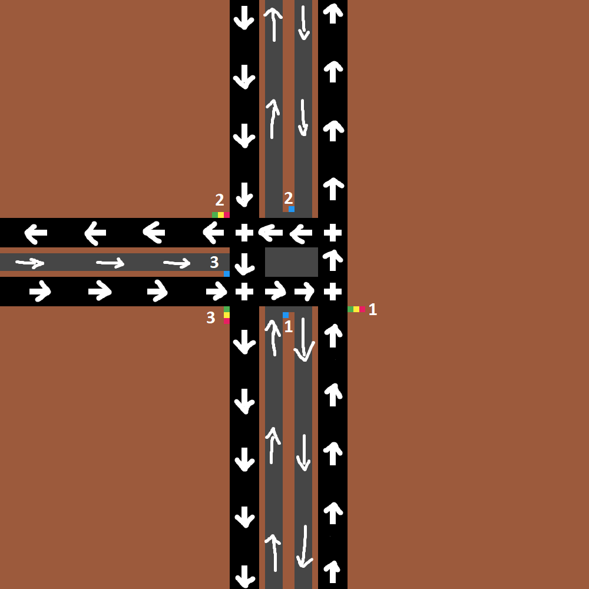
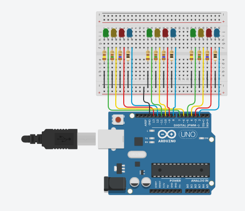
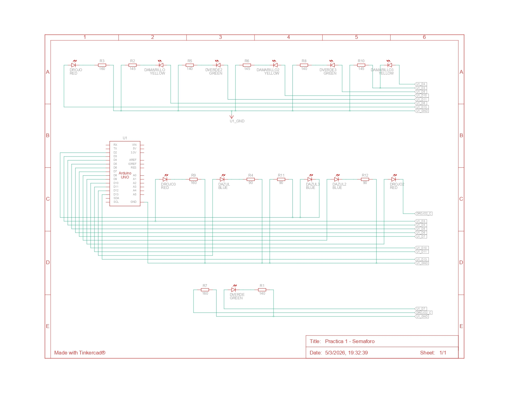

# Semaforo Arduino Uno R4 (Tinkercad)

Sistema de señalización vial controlado por Arduino, diseñado para gestionar el flujo de tráfico en intersecciones mediante 12 LEDs sincronizados y resistencias calculadas para optimizar el brillo y la vida útil de cada componente. Proyecto realizado durante clases de robotica y propuesto por el profesor Hector Mendoza.

## Integrantes
* Reimil Azuaje
* Jenderson Abarca

## Descripción del Circuito

El sistema consta de 12 LEDs en total, organizados en tres grupos de cuatro. Cada grupo representa un semáforo independiente (Luz roja, amarilla y verde para vehículos regulares. Luz azul para Transbarca.)

Microcontrolador: Arduino Uno R3.

Protoboard: Los LEDs comparten una línea común de tierra (GND) conectada al riel negativo de la protoboard mediante el cable negro que sale del pin GND del Arduino.

Conexiones de Control: Cada LED está conectado a un pin digital individual del Arduino (del pin 2 al pin 13), lo que permite controlar cada luz de forma independiente mediante programación.

Protección: Cada LED tiene una resistencia en serie conectada al cátodo (pata corta) que drena hacia el bus de tierra.

## Análisis de las resistencias

Las resistencias son necesarias para limitar la corriente que fluye a través de los LEDs. Si no se utilizan resistencias, los LEDs se quemarán.

La fórmula para calcular la resistencia necesaria es:

```
R = (Vcc - Vf) / I
```

Donde:

```
Vcc = Voltaje de alimentación (5V)
```

```
Vf = Voltaje directo del LED (1.8V para el led rojo, 2.1V para el led amarillo, 2.2V para el led verde y 3.2V para el led azul)
```

```
I = Corriente directa del LED (aproximadamente 20mA)
```

Por lo tanto, la resistencia necesaria para cada led respectivamente es:    

```
R = (5V - 1.8V) / 0.02A = 160 ohmios
```

```
R = (5V - 2.1V) / 0.02A = 145 ohmios
```

```
R = (5V - 2.2V) / 0.02A = 140 ohmios
```

```
R = (5V - 3.2V) / 0.02A = 90 ohmios
```

## Modelo Vial



## Imagen del Circuito



## Diagrama de Conexiones



## Lista de Componentes

| Cantidad | Componente        |
|----------|-------------------|
| 1        |  Arduino Uno R3   |
| 3        | 140 Ω Resistencia |
| 3        | 145 Ω Resistencia |
| 3        | 160 Ω Resistencia |
| 3        | Rojo LED          |
| 3        | Amarillo LED      |
| 3        | Verde LED         |
| 3        | 90 Ω Resistencia  |
| 3        | Azul LED          |
